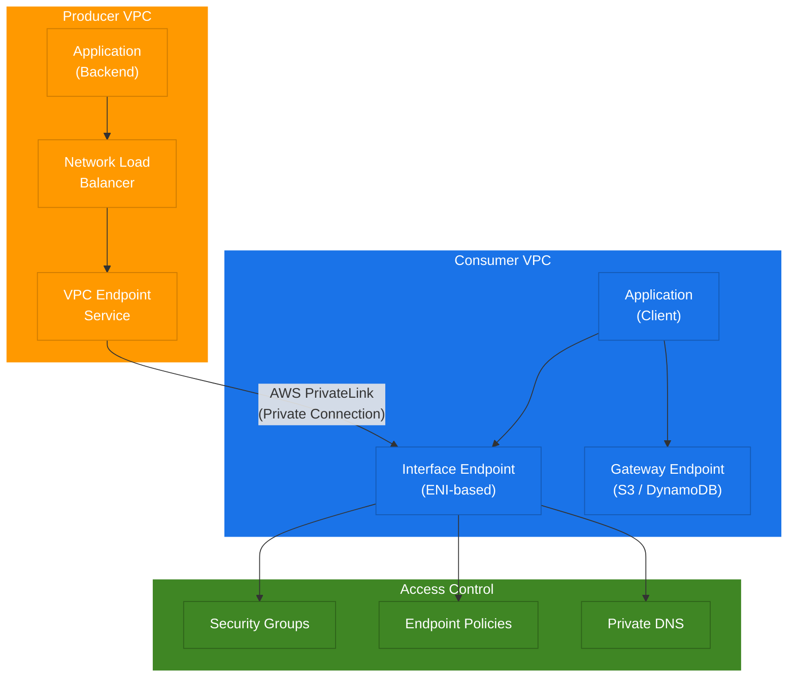

# terraform-aws-privatelink

Terraform module for AWS PrivateLink and VPC Endpoint Service, enabling private connectivity between VPCs and AWS services without exposing traffic to the public internet.

## Architecture

This module supports the full AWS PrivateLink producer/consumer pattern:

```
                        AWS PrivateLink Architecture
                     (Producer / Consumer Pattern)

    Producer VPC                                    Consumer VPC
    +-----------------------------------------+     +-----------------------------------------+
    |                                         |     |                                         |
    |  +-------------------+                  |     |                  +-------------------+  |
    |  |   Application     |                  |     |                  |   Application     |  |
    |  |   (Backend)       |                  |     |                  |   (Client)        |  |
    |  +--------+----------+                  |     |                  +--------+----------+  |
    |           |                             |     |                           |              |
    |           v                             |     |                           v              |
    |  +--------+----------+                  |     |                  +--------+----------+  |
    |  | Network Load      |                  |     |                  | VPC Endpoint      |  |
    |  | Balancer (NLB)    |                  |     |                  | (Interface)       |  |
    |  +--------+----------+                  |     |                  +--------+----------+  |
    |           |                             |     |                           |              |
    |           v                             |     |                           |              |
    |  +--------+----------+    AWS           |     |                           |              |
    |  | VPC Endpoint      |    PrivateLink   |     |                           |              |
    |  | Service           +<=============================>+  ENI (Elastic     |              |
    |  | (Producer)        |    (Private      |     |      |  Network          |              |
    |  +-------------------+     Connection)  |     |      |  Interface)       |              |
    |                                         |     |      +-------------------+              |
    +-----------------------------------------+     +-----------------------------------------+

    Key Components:
    - Producer: Hosts the service behind an NLB/GWLB + Endpoint Service
    - Consumer: Creates a VPC Endpoint to connect to the producer's service
    - Traffic flows over AWS backbone network (never traverses public internet)
    - Endpoint Service controls access via allowed principals + acceptance

    Supported Endpoint Types:
    +------------------+------------------------------------------------+
    | Type             | Description                                    |
    +------------------+------------------------------------------------+
    | Interface        | ENI-based, supports PrivateLink services and   |
    |                  | most AWS services (e.g., SSM, KMS, ECR)        |
    +------------------+------------------------------------------------+
    | Gateway          | Route-table based, supports S3 and DynamoDB    |
    +------------------+------------------------------------------------+
```

### Component Diagram



## Features

- **Producer Side**: Create VPC Endpoint Services backed by NLB or GWLB
- **Consumer Side**: Create VPC Endpoints (Interface and Gateway types)
- **Access Control**: Manage allowed principals for endpoint service connections
- **Connection Acceptance**: Automatic or manual connection acceptance workflow
- **Security Groups**: Auto-created default security group for Interface endpoints
- **Endpoint Policies**: Attach IAM policies to VPC endpoints for fine-grained access
- **Private DNS**: Support for private DNS names on endpoint services and endpoints

## Usage

### Basic - Consumer VPC Endpoints

```hcl
module "vpc_endpoints" {
  source  = "kogunlowo123/privatelink/aws"

  name   = "my-app"
  vpc_id = "vpc-0123456789abcdef0"

  endpoints = {
    s3 = {
      service_name = "com.amazonaws.us-east-1.s3"
      type         = "Gateway"
    }
    ssm = {
      service_name        = "com.amazonaws.us-east-1.ssm"
      type                = "Interface"
      subnet_ids          = ["subnet-aaa", "subnet-bbb"]
      private_dns_enabled = true
    }
  }

  tags = {
    Environment = "production"
  }
}
```

### Advanced - Producer Endpoint Service

```hcl
module "endpoint_service" {
  source  = "kogunlowo123/privatelink/aws"

  name   = "my-service"
  vpc_id = "vpc-producer123"

  create_endpoint_service    = true
  network_load_balancer_arns = [aws_lb.nlb.arn]
  acceptance_required        = true

  allowed_principals = [
    "arn:aws:iam::111111111111:root",
  ]

  create_vpc_endpoints = false

  tags = {
    Environment = "production"
  }
}
```

## Requirements

| Name | Version |
|------|---------|
| terraform | >= 1.5.0 |
| aws | >= 5.20.0 |

## Providers

| Name | Version |
|------|---------|
| aws | >= 5.20.0 |

## Resources

| Name | Type |
|------|------|
| aws_vpc_endpoint_service.this | resource |
| aws_vpc_endpoint_service_allowed_principal.this | resource |
| aws_vpc_endpoint.this | resource |
| aws_vpc_endpoint_connection_accepter.this | resource |
| aws_security_group.endpoint | resource |
| aws_vpc_endpoint_policy.this | resource |
| aws_vpc.this | data source |
| aws_region.current | data source |
| aws_caller_identity.current | data source |

## Inputs

| Name | Description | Type | Default | Required |
|------|-------------|------|---------|:--------:|
| name | Name prefix for all resources | `string` | n/a | yes |
| vpc_id | The ID of the VPC | `string` | n/a | yes |
| create_endpoint_service | Whether to create a VPC Endpoint Service | `bool` | `false` | no |
| network_load_balancer_arns | NLB ARNs for the endpoint service | `list(string)` | `[]` | no |
| gateway_load_balancer_arns | GWLB ARNs for the endpoint service | `list(string)` | `[]` | no |
| acceptance_required | Whether connection requests require acceptance | `bool` | `true` | no |
| allowed_principals | ARNs of principals allowed to connect | `list(string)` | `[]` | no |
| private_dns_name | Private DNS name for the endpoint service | `string` | `null` | no |
| create_vpc_endpoints | Whether to create VPC endpoints | `bool` | `true` | no |
| endpoints | Map of VPC endpoint configurations | `map(object)` | `{}` | no |
| tags | Tags to apply to all resources | `map(string)` | `{}` | no |

## Outputs

| Name | Description |
|------|-------------|
| endpoint_service_id | The ID of the VPC Endpoint Service |
| endpoint_service_name | The service name of the VPC Endpoint Service |
| endpoint_ids | Map of endpoint keys to their VPC Endpoint IDs |
| endpoint_dns_entries | Map of endpoint keys to their DNS entries |
| security_group_id | The ID of the default security group for endpoints |

## Examples

- [Basic](examples/basic/) - Simple consumer VPC endpoints for AWS services
- [Advanced](examples/advanced/) - Producer/consumer PrivateLink pattern
- [Complete](examples/complete/) - Full setup with VPCs, NLB, endpoint service, and multiple consumers

## License

MIT Licensed. See [LICENSE](LICENSE) for full details.

## Authors

Module managed by [kogunlowo123](https://github.com/kogunlowo123).
